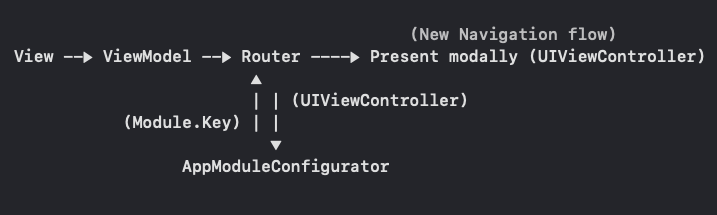

# #мамавыдохни
### Основной модуль проекта #мамавыдохни
Приложение будет полезно молодым мамам, которые сталкиваются с распространенными проблемами по уходу за ребёнком и нуждаются в информационной поддержке.

 

### Основной модуль включает в себя подпроекты:

[#мамавыдохни: напоминания](https://github.com/4440449/CalmMom)  
 Получайте уведомления, которые содержат поддерживающую цитату дня. Сохраняйте понравившиеся цитаты в виде обоев для телефона.
 
 

[#мамавыдохни: самоприкорм](https://github.com/4440449/Samoprikorm_SP)  
Ищите продукты для первого прикорма с помощью быстрого поиска по базе с информацией о правильной подаче, содержании аллергенов и рекомендуемом возрасте для ребенка по системе BLW (современный метод ввода прикорма).

 

[#мамавыдохни: трекер](https://github.com/4440449/BabyTrackerWW)  
Записывайте и отслеживайте динамику состояния вашего малыша перед сном и после сна, чтобы разобраться, что именно мешает малышу спать лучше.

#### Галереи «Блог» и «Базовые статьи»  
Читайте статьи о физиологии детского сна, детско-родительских отношениях и привязанности.

                
## Tech specs
- Модульная архитектура, проект разделен на подпроекты, которые инъектятся через SPM обертку
- MVVМ + R. Элементы Clean architecture
- Каждый экран выделен в отдельную сцену со своим окружением (Configurator, ViewModel, Router)
- Плоский Navigation Flow с Repository store container, подробнее [здесь](https://github.com/4440449/CalmMom/blame/master/README.md#L22-L38)
- DI для каждой сцены со сбокрой через static объект
- Observing через [собственную библиотеку](https://github.com/4440449/MommysEye)
- Network через [собственную библиотеку](https://github.com/4440449/BabyNet)
- Backend - <a href="https://app.supabase.com">Supabase</a>
- Project Targets
- UI - UIKit, кодом
- Dark mode

## Features
         
* Навигация по модулям происходит через отдельный [Конфиг объект](https://github.com/4440449/Mom_Exhale/blob/master/Mom_Exhale/Source/AppConfigurator/AppModuleConfigurator_ME.swift), в котором инкапсулированы все зависимости. Делая свич по входящему ключу, Конфиг предоставляет ту или иную реализацию презентуемого модуля в виде его начального View Controller с полным окружением и зависимостями. Далее, полученный View Controller презентится модально.  
    **Схема:**  
    
                         
* Проект разделен на таргеты, переключая которые можно переходить в режим отладки, либо как самостоятельного проекта, либо как основного модуля для других проектов.
         
* Все четыре подмодуля построены на разных UI интерфейсах (UIKit Storyboard, UIKit code, SwiftUI). А также реализуют разную архитектуру (MVVM, MVP, Redux) с некоторыми ситуативными доработками, подробнее про каждый проект см. выше в шапке файла.
        
* Преимущества модульной архитектуры:
    + Переиспользование модулей в других проектах
    + Легкое выпиливание / отключение неактуального модуля
    + Удобство разработки / отладки модуля, как самостоятельного небольшого проекта, скорость сборки
    + Каждый модуль содержит свой пул зависимостей, что подразумевает отсутствие конфликтов
    + Меньший размер модуля по сравнению с монолитным приложением
            

## TODO 
- Authorization
- In app handling dark mode
- Article detail scene

## Requirements
iOS 14.0 +  
Xcode 13.2.1 +

# HOW TO USE APP
Главный экран содержит несколько блоков: галерею из статей блога, галерею из базовых статей сайта #мамавыдохни и 3 модуля (мини-приложения) – 'Трекер сна’’, Напоминания', 'Прикорм'. 

 

